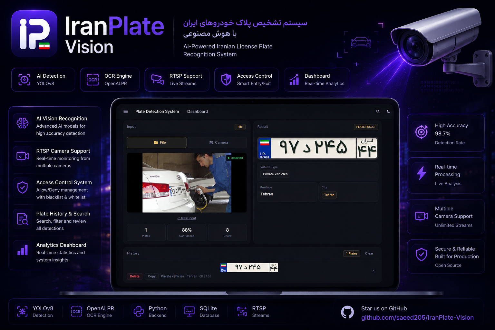
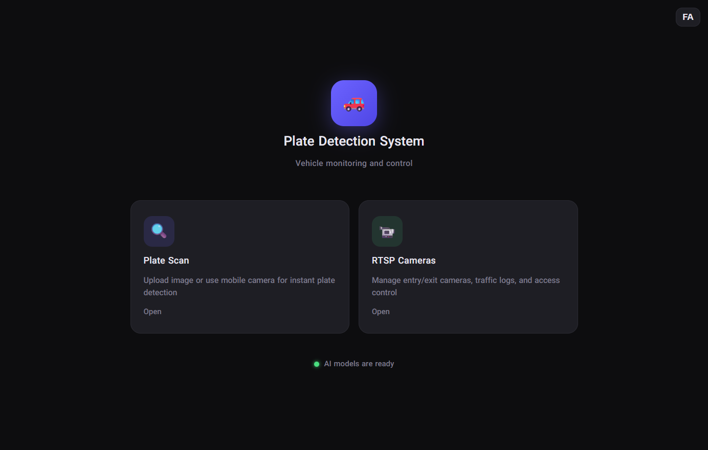
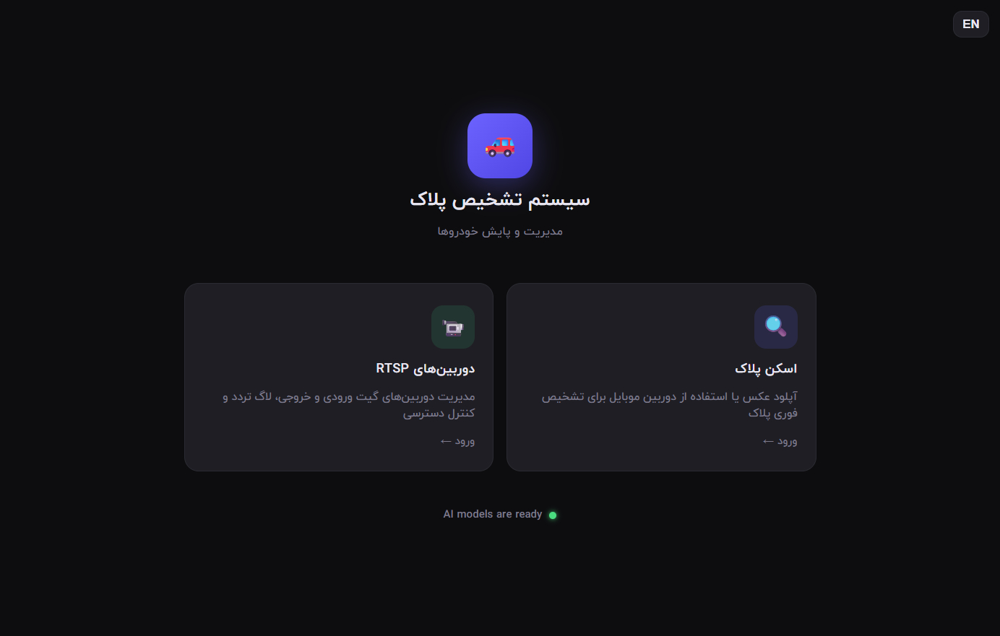
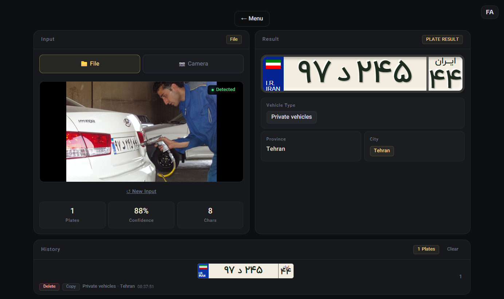
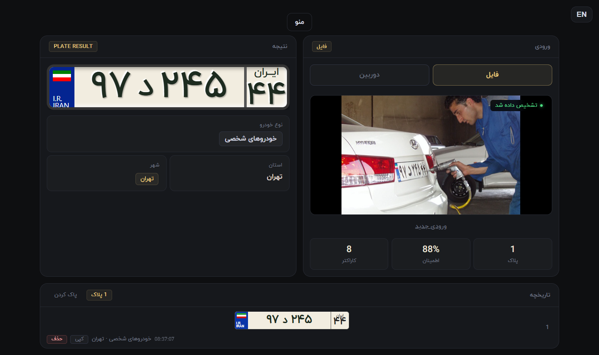
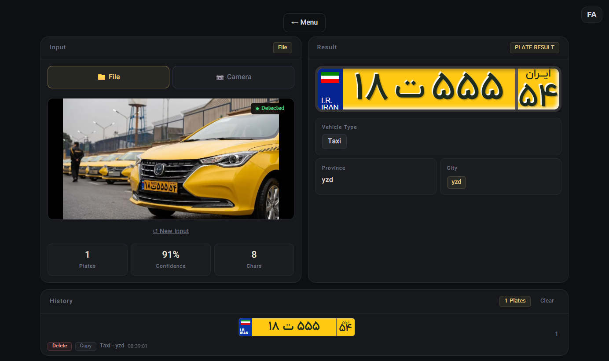
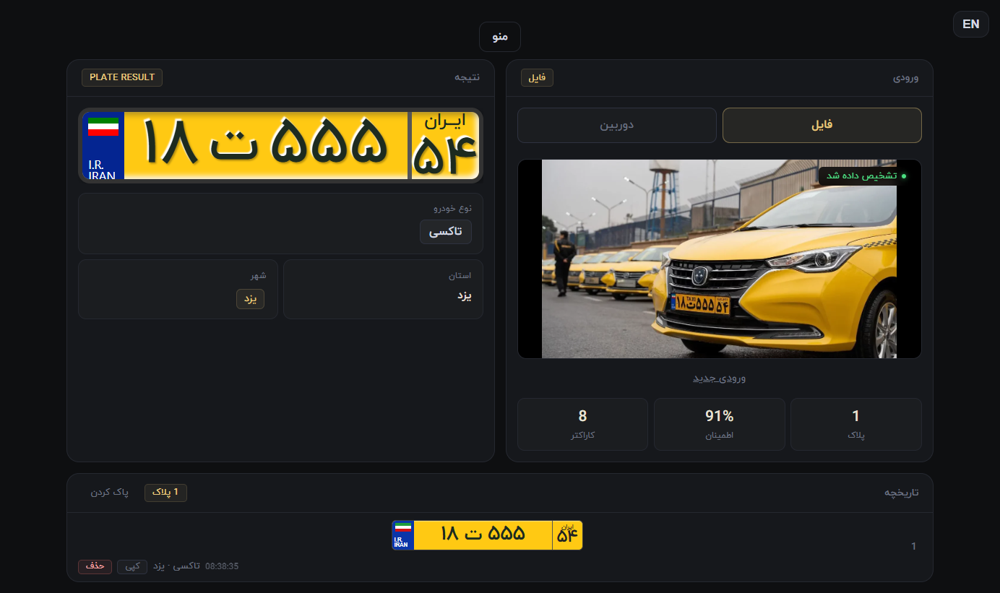
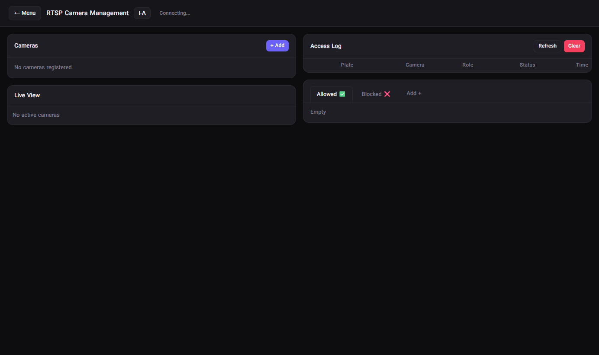
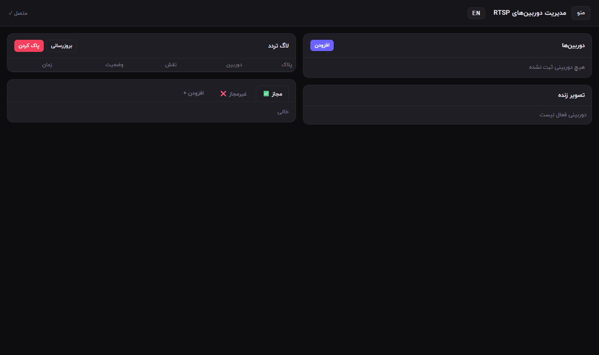

# IranPlate Vision | سامانه IranPlate Vision

<div align="center">


</div>



> Real-time Persian plate detection + RTSP monitoring + bilingual dashboard, runnable in minutes.
>
> Note: This repository is maintained as a fork of [12345zahraa/Persian-Plates-Detection](https://github.com/12345zahraa/Persian-Plates-Detection).

## Demo

## Screenshots

### Home
| EN | FA |
|---|---|
|  |  |

### Scan & Result
| EN | FA |
|---|---|
|  |  |
|  |  |

### RTSP Cameras
| EN | FA |
|---|---|
|  |  |

## Why This Project Is Different | تفاوت این پروژه
- End-to-end workflow: detection + OCR + metadata + camera events in one app.
- Built-in multi-camera RTSP workers with reconnect and SSE live feed.
- Bilingual docs/messages (English + Persian) for broader adoption.

## One Command Run
```bash
make up
```
Then open `http://localhost:5000`.

## راهنمای فارسی سریع
این پروژه یک سامانه تشخیص پلاک ایرانی است که شامل:
- تشخیص پلاک با مدل YOLO
- OCR پلاک فارسی
- مدیریت دوربین‌های RTSP
- ثبت لاگ تردد و مدیریت لیست مجاز/غیرمجاز

### اجرای سریع
```bash
python -m venv .venv
.venv\Scripts\activate
pip install -r requirements.txt
python app.py
```

آدرس‌ها:
- `http://localhost:5000`
- `http://localhost:5000/scan`
- `http://localhost:5000/cameras`

### اجرای Docker
```bash
docker compose up --build
```

### تست سلامت
ابتدا سرور را بالا بیاورید، سپس:
```bash
python scripts/smoke_test.py
```

## Quick Local Run
```bash
python -m venv .venv
.venv\\Scripts\\activate
pip install -r requirements.txt
python app.py
```

## Local HTTPS (Test Only)
If you want to run local HTTPS for camera/mobile testing, create a self-signed certificate:

### Windows (PowerShell + OpenSSL)
```bash
openssl req -x509 -newkey rsa:2048 -nodes -days 365 \
  -keyout key.pem -out cert.pem \
  -subj "/C=IR/ST=Tehran/L=Tehran/O=IranPlateVision/OU=Dev/CN=localhost"
```

Then run:
```bash
python run_https.py
```

Notes:
- `cert.pem` and `key.pem` are for local development/testing only.
- For production/public deployment, use a valid certificate from a trusted CA (or your organization PKI).
- Do not commit real private keys to Git.

## Smoke Test
Start the app first, then:
```bash
python scripts/smoke_test.py
```

## Docker
```bash
docker compose up --build
```

## Project Structure
```text
.
├── app.py
├── camera_manager.py
├── db.py
├── run_https.py
├── best.pt
├── plate_data.json
├── templates/
├── static/
├── fonts/
├── scripts/smoke_test.py
├── Dockerfile
├── docker-compose.yml
├── Makefile
└── .github/
```

## API Endpoints
- `GET /status`
- `POST /detect`
- `GET/POST /api/cameras`
- `PUT/DELETE /api/cameras/<id>`
- `POST /api/cameras/<id>/toggle`
- `GET /api/cameras/<id>/snapshot`
- `GET /api/events`
- `GET/DELETE /api/log`
- `GET/POST /api/vehicles`
- `DELETE /api/vehicles/<plate>`

## Launch Checklist (Trending Pack)
- Add `docs/demo.gif` and 3 screenshots.
- Set GitHub topics: `license-plate-recognition`, `persian-ocr`, `yolo`, `flask`, `rtsp`, `computer-vision`.
- Publish release `v1.0.0` with concise release notes.
- Share launch post on X/LinkedIn/Reddit with demo.
- Keep issue/PR response fast in first 24 hours.

## Public Release Checklist
- Remove local HTTPS secrets and DB artifacts before first public push:
  `cert.pem`, `key.pem`, `traffic.db`, `traffic.db-shm`, `traffic.db-wal`.
- Keep large model files out of Git when possible (`best.pt`), or use release assets / model download step.
- Verify `.gitignore` is active in the actual Git repo root.
- Run smoke test before tagging:
  `python scripts/smoke_test.py`
- Confirm both `/scan` and `/cameras` views work in `EN` and `FA`.

## Contributing
See:
- `.github/ISSUE_TEMPLATE/bug_report.yml`
- `.github/ISSUE_TEMPLATE/feature_request.yml`
- `.github/pull_request_template.md`

## License
MIT - see `LICENSE`.
